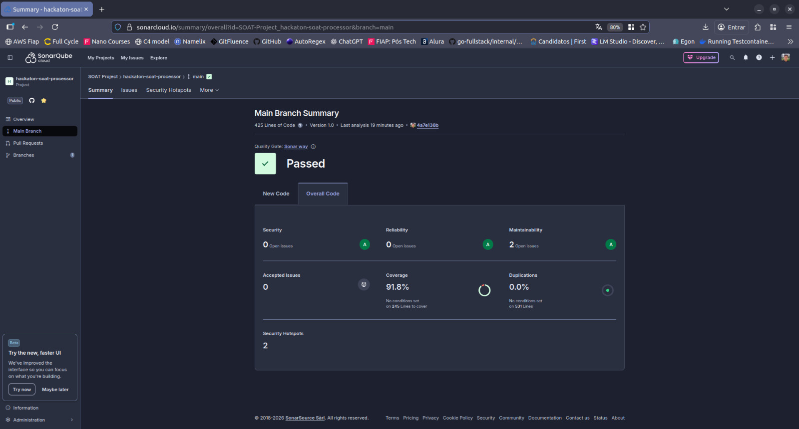
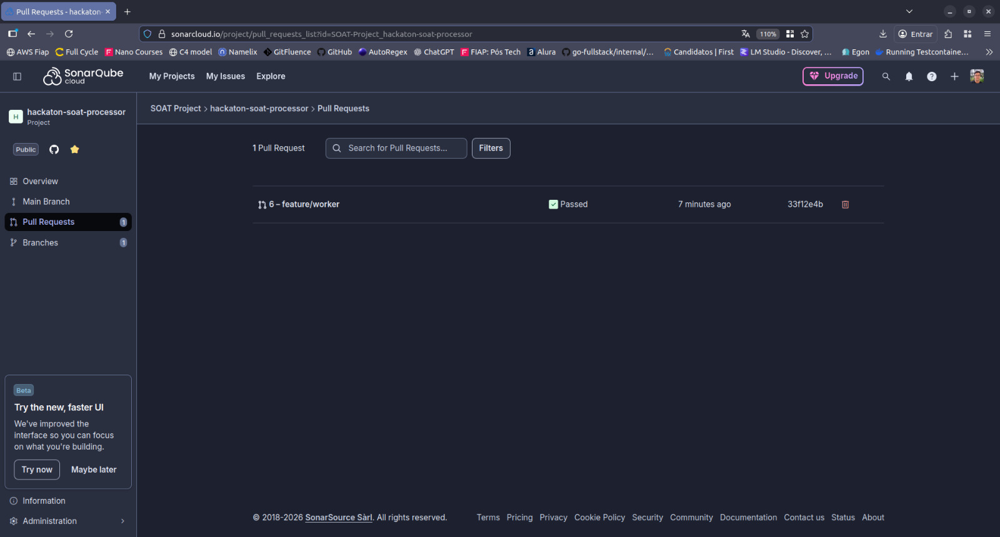

# Hackaton SOAT Processor

Worker responsável por processar vídeos extraindo frames individuais. Este serviço consome mensagens de uma fila SQS, processa vídeos armazenados no S3 e envia notificações sobre o resultado do processamento.

## 📋 Descrição

Este worker realiza as seguintes operações:

1. **Consumo de Mensagens**: Monitora a fila SQS `hackaton-soat-process` aguardando novas solicitações de processamento
2. **Download do Vídeo**: Obtém o arquivo de vídeo do bucket S3 especificado
3. **Extração de Frames**: Quebra o vídeo em frames individuais (imagens)
4. **Compactação**: Cria um arquivo ZIP contendo todas as imagens extraídas
5. **Upload**: Envia o arquivo ZIP para o bucket `hackaton-soat-storage`
6. **Notificação**: Publica o resultado (sucesso ou erro) na fila `hackaton-soat-processed`

## 🔄 Fluxo de Dados

### Mensagem de Entrada (SQS: `hackaton-soat-process`)

```json
{
  "process_id": "string",
  "video_bucket": "string",
  "video_key": "string"
}
```

**Campos:**

- `process_id`: Identificador único do processamento
- `video_bucket`: Nome do bucket S3 onde o vídeo está armazenado
- `video_key`: Caminho/chave do arquivo de vídeo no bucket

### Mensagem de Saída (SQS: `hackaton-soat-processed`)

#### Em caso de sucesso

```json
{
  "process_id": "string",
  "file_bucket": "string",
  "file_key": "string"
}
```

**Campos:**

- `process_id`: Identificador único do processamento
- `file_bucket`: Nome do bucket onde o resultado foi armazenado (`hackaton-soat-storage`)
- `file_key`: Caminho do arquivo ZIP processado (`processed/frames_{process_id}.zip`)

#### Em caso de erro

```json
{
  "process_id": "string",
  "error_message": "string"
}
```

**Campos:**

- `process_id`: Identificador único do processamento
- `error_message`: Descrição do erro ocorrido

## 🚀 Tecnologias

- **Go**: Linguagem de programação (v1.25.3)
- **AWS SQS**: Serviço de filas de mensagens
- **AWS S3**: Armazenamento de objetos
- **Kubernetes**: Orquestração de containers
- **Terraform**: Infrastructure as Code

## 📁 Estrutura do Projeto

```text
.
├── app/                    # Código-fonte da aplicação
│   ├── cmd/               # Entrypoint da aplicação
│   ├── internal/          # Código interno (domínio, serviços, etc)
│   └── go.mod            # Dependências Go
├── infra/                 # Infraestrutura
│   ├── kubernetes/       # Manifestos Kubernetes
│   └── terraform/        # Configuração Terraform
├── LICENSE               # Licença do projeto
└── README.md            # Este arquivo
```

## ⚙️ Configuração

### Variáveis de Ambiente

As seguintes variáveis de ambiente devem ser configuradas:

```bash
# AWS Configuration
AWS_REGION=us-east-1
AWS_ACCESS_KEY_ID=your-access-key
AWS_SECRET_ACCESS_KEY=your-secret-key

# SQS Queues
SQS_INPUT_QUEUE_URL=https://sqs.region.amazonaws.com/account/hackaton-soat-process
SQS_OUTPUT_QUEUE_URL=https://sqs.region.amazonaws.com/account/hackaton-soat-processed

# S3 Configuration
S3_OUTPUT_BUCKET=hackaton-soat-storage

# Worker Configuration
WORKER_CONCURRENCY=5
POLLING_INTERVAL=10
```

## 🛠️ Desenvolvimento

### Pré-requisitos

- Go 1.25.3+
- Docker (opcional)
- AWS CLI configurado
- Acesso às filas SQS e buckets S3

### Instalação

1. Clone o repositório:

```bash
git clone https://github.com/SOAT-Project/hackaton-soat-processor.git
cd hackaton-soat-processor
```

2. Entre no diretório da aplicação:

```bash
cd app
```

3. Instale as dependências:

```bash
go mod download
```

4. Configure as variáveis de ambiente:

```bash
cp .env.example .env
# Edite o arquivo .env com suas configurações
```

### Executando Localmente

```bash
cd app
go run cmd/main.go
```

### Build

```bash
cd app
go build -o processor cmd/main.go
```

### Executando com Docker

```bash
docker build -t hackaton-soat-processor:latest .
docker run --env-file app/.env hackaton-soat-processor:latest
```

## 🚢 Deploy

### Kubernetes

Os manifestos do Kubernetes estão disponíveis em `infra/kubernetes/`:

```bash
kubectl apply -f infra/kubernetes/
```

### Terraform

Para provisionar a infraestrutura necessária (filas SQS, buckets S3, etc):

```bash
cd infra/terraform
terraform init
terraform plan
terraform apply
```

## 📊 Observabilidade

O worker possui stack completa de observabilidade com **logs estruturados**, **métricas** e **dashboards**.

### Componentes

- **Logs**: Zap (JSON estruturado)
- **Métricas**: Prometheus
- **Visualização**: Grafana
- **Health Checks**: `/health` e `/ready`

### Endpoints

- **Métricas**: http://localhost:8080/metrics
- **Health Check**: http://localhost:8080/health
- **Readiness**: http://localhost:8080/ready
- **Prometheus UI**: http://localhost:9090
- **Grafana**: http://localhost:3000 (admin/admin123)

### Métricas Disponíveis

- `worker_messages_processed_total` - Total de mensagens processadas
- `worker_videos_processed_total` - Total de vídeos processados
- `worker_processing_duration_seconds` - Duração do processamento (histograma)
- `worker_frames_extracted_last` - Frames extraídos do último vídeo
- `worker_errors_total` - Total de erros por tipo
- `worker_s3_operations_total` - Operações S3 por tipo e status
- `worker_sqs_operations_total` - Operações SQS por tipo e status
- `worker_messages_active` - Mensagens sendo processadas
- `worker_file_size_bytes` - Tamanho dos arquivos (histograma)

### Dashboard Grafana

O dashboard "Video Processor Worker Overview" inclui 7 painéis:

1. **Processing Rate** - Taxa de processamento (vídeos/min)
2. **Success Rate** - Porcentagem de sucesso
3. **Processing Duration** - Percentis p50, p95, p99
4. **Frames Extracted** - Frames do último vídeo
5. **Errors by Type** - Erros categorizados
6. **S3 Operations** - Operações no S3
7. **Messages Processed** - Mensagens processadas

### Iniciar Stack de Observabilidade

```bash
cd app
docker compose up -d
```

Isso iniciará:
- Worker (porta 8080)
- Prometheus (porta 9090)
- Grafana (porta 3000)

Para mais detalhes, consulte [observability/SETUP.md](app/observability/SETUP.md).

## 🧪 Testes

```bash
cd app
go test ./...
```

Para testes com cobertura:

```bash
go test -cover ./...
```

## Sonar

Para garantia de qualidade do projeto, também foi adicionada integração com o sonar.





## 🤝 Contribuindo

1. Fork o projeto
2. Crie uma branch para sua feature (`git checkout -b feature/AmazingFeature`)
3. Commit suas mudanças (`git commit -m 'Add some AmazingFeature'`)
4. Push para a branch (`git push origin feature/AmazingFeature`)
5. Abra um Pull Request

## 📄 Licença

Este projeto está sob a licença especificada no arquivo [LICENSE](LICENSE).

## 👥 Equipe SOAT

Desenvolvido por SOAT-Project

---

**Nota**: Este é um projeto educacional desenvolvido como parte do Hackaton SOAT.
